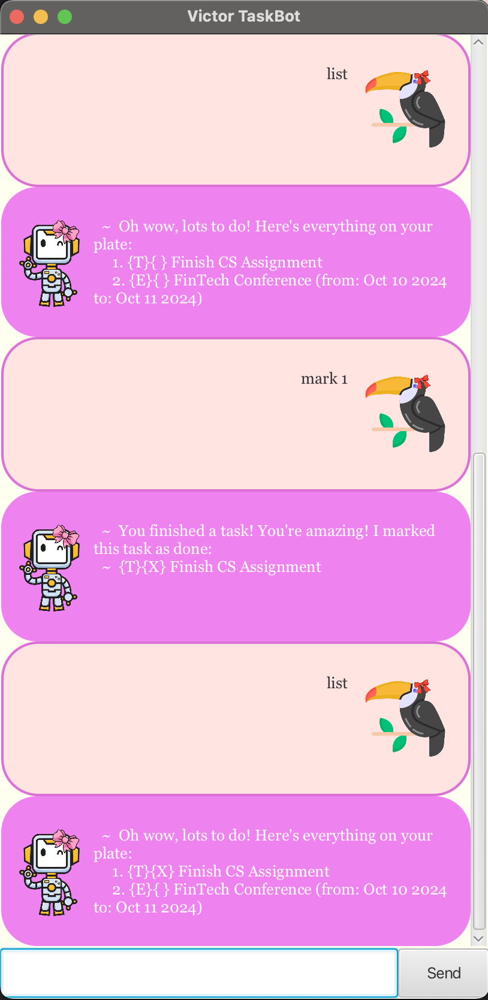

# Victor TaskBot User Guide

The Victor TaskBot is your best bet for keeping track of your To-Dos, Events, and Deadlines in a cute, stylish way!
Victor saves your tasks and loads them up for you each time you open the app, so you never have to worry about losing
track of any tasks!

# Prerequisites

* JDK 17
* Update Intellij to the most recent version.

# Set-up (for IntelliJ IDE)

1. Open Intellij (if you are not in the welcome screen, click `File` > `Close Project` to close the existing project first)
2. Open the project into Intellij as follows:
    1. Click `Open`.
    2. Select the project directory, and click `OK`.
    3. If there are any further prompts, accept the defaults.
3. Configure the project to use **JDK 17** (not other versions) as explained in [here](https://www.jetbrains.com/help/idea/sdk.html#set-up-jdk). 
   In the same dialog, set the **Project language level** field to the `SDK default` option.
4. After that, locate the `src/main/java/Launcher.java` file, right-click it, and choose `Run Launcher.main()` (if the code editor is showing compile errors, try restarting the IDE).

## Adding to-dos

> Words in **ALL_CAPITALS** are parameters to be supplied by the user

Add a to-do to your task list by typing in the command todo, followed by the name of your todo.

**Format:** todo TASK_DESCRIPTION

Examples:
* todo Finish CS Assignment 
* todo Task with Very Long Description

## Adding deadlines

Add a deadline by typing in the command deadline, followed by the name and the date of the deadline.

**Format:** deadline DEADLINE_DESCRIPTION /by DATE

> Dates for deadlines and events should be input either in YYYY-MM-DD or DD-MM-YYYY format.

Examples:

* deadline Submit Report /by 11-12-2024
* deadline Call Office of Admissions /by 2029-01-01

## Adding events

Add an event by typing in the command event, followed by the name, the start date, and the end date of the event.

**Format**: event EVENT_DESCRIPTION /from START_DATE /to END_DATE

Examples:

* event Attend Conference /from 06-06-2025 /to 09-09-2025
* event Quantitative Finance Take-Home Exam /from 2021-03-20 /to 2021-03-22

> * Make sure your end date is after your start date!
> * The start and end dates can be input in different formats.

You should see Victor's response keeping track of your deadline, similar to this:

## Marking tasks as complete or unfinished

Mark any task as finished or unfinished by typing in the command mark/unmark and the number of the task.

**Format:** (un)mark TASK_NUMBER

Examples:

* mark 2
* unmark 19

> Task numbering starts from 1 in the Victor TaskBot system.

## Listing tasks

To see all the tasks Victor is keeping track of, just type in list.

**Format:** list

## Deleting tasks

Delete tasks by typing in the delete command and the number of the task you want to delete.

**Format:** delete TASK_NUMBER

## Finding tasks by keyword

Find a task based on a keyword or phrase by typing in find followed by the keyword or phrase you want to find.

**Format:** find KEYWORD 

Examples:

* find call
* find Submit report

## Exiting the application

To exit the application, either close the window manually or type in exit or bye.

**Format:** bye/exit

## Saving and Loading Data

The tasks input in one session are automatically saved to the hard disk
and loaded when another session of the application is started. If a line of the file is
in the wrong format, the application will overwrite that line and delete it from its records.
If no file is found, then the application will create a new file at /data/data.txt to store
the data.

# Credits

The Victor TaskBot project is based on the original Duke project by NUS Computing. Credit is given to the team for
providing the foundation for this project.